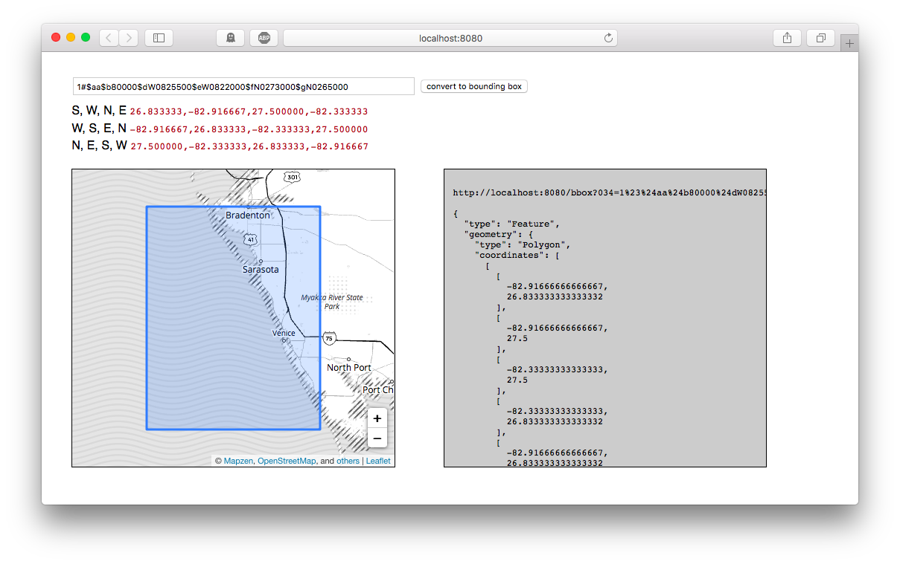

# go-marc

Go package for working with MARC records.

## Important

Not all of MARC. Probably not ever. Just the `034` field so far.

## Tools

### marc-034

Convert a MARC 034 string in to a (S, W, N, E) bounding box.

```
./bin/marc-034 -h
Usage of ./bin/marc-034:
  -f string
    	A valid MARC 034 string (default "1#$aa$b22000000$dW1800000$eE1800000$fN0840000$gS0700000")
```

Currently this only supports `hdddmmss (hemisphere-degrees-minutes-seconds)` and `dddmmss (degrees-minutes-seconds)` notation. For example:

```
./bin/marc-034
2017/02/13 22:23:38 1#$aa$b22000000$dW1800000$eE1800000$fN0840000$gS0700000 <-- input (MARC 034)
2017/02/13 22:23:38 -70.000000, -180.000000 84.000000, 180.000000 <-- output (decimal WSG84)
```

### marc-034d

A web server for converting MARC 034 strings in to bounding boxes (formatted as GeoJSON)

```
./bin/marc-034d -h
Usage of ./bin/marc-034d:
  -host string
    	The hostname to listen for requests on (default "localhost")
  -httptest.serve string
    	if non-empty, httptest.NewServer serves on this address and blocks
  -mapzen-api-key string
    	A valid Mapzen API key (default "mapzen-xxxxxx")
  -port int
    	The port number to listen for requests on (default 8080)
```

For example:

```
$> ./bin/marc-034d -mapzen-api-key mapzen-1a2b3c

2018/01/12 09:12:44 listening on localhost:8080
```

The `marc-034d` server exposes the following endpoints:

#### / (or "root")

The `/` (or default) endpoint will display a handy web interface for converting MARC 034 records in to bounding boxes. For example, here's what it looks like querying for `1#$aa$b80000$dW0825500$eW0822000$fN0273000$gN0265000`:



#### /bbox

The `/bbox` endpoint will return a bounding box for a MARC 034 field as GeoJSON.

```
$> curl -s 'http://localhost:8080/bbox?034=1%23%24aa$b22000000%24dW1800000%24eE1800000%24fN0840000%24gS0700000' | python -mjson.tool

{
    "bbox": [
        -180,
        -70,
        180,
        84
    ],
    "geometry": {
        "coordinates": [
            [
                [
                    -180,
                    -70
                ],
                [
                    -180,
                    84
                ],
                [
                    180,
                    84
                ],
                [
                    180,
                    -70
                ],
                [
                    -180,
                    -70
                ]
            ]
        ],
        "type": "Polygon"
    },
    "properties": {
        "marc:034": "1#$aa$b22000000$dW1800000$eE1800000$fN0840000$gS0700000"
    },
    "type": "Feature"
}
```

_Note the way the `034` parameter is URL-encoded._

## Docker

[Yes](Docker), for `marc-034d` at least.

```
docker build -t marc-034d .
docker run -it -p 8080:8080 -e 'MAPZEN_APIKEY=$(MAPZEN_APIKEY)' marc-034d
```

## Caveats

* There are still problems running this on `localhost` (for example from the Dockerfile on your laptop) under Firefox. I haven't had time to figure out if this is a paranoid security feature in Firefox or if I am just "doing it wrong".
* Mapzen, [iknowrite](https://mapzen.com/blog/shutdown/)? Mapzen are shutting down as of February, 2018 and this package use Mapzen tiles (and the `mapzen.js` library) for displaying maps. The good news about the shutdown is that requiring an API key will be a moot point. The bad news is that it's not clear, as of this writing, where the vector tiles are going to come from. Either way this package uses the [go-http-mapzenjs](https://github.com/whosonfirst/go-http-mapzenjs) package to bundle all the `mapzen.js` assets and hide all the details from you so if there is a need to replace the Mapzen stuff with [ some other mapping provider ] it shouldn't be a big deal. The details are [over here](https://github.com/aaronland/go-marc/blob/master/cmd/marc-034d.go#L28-L43) if you're curious. For the time being you can still [sign up for a Mapzen API key](https://mapzen.com/developers/).

## See also

* https://www.loc.gov/marc/bibliographic/bd034.html
* https://github.com/whosonfirst/go-http-mapzenjs
* https://mapzen.com/developers/
