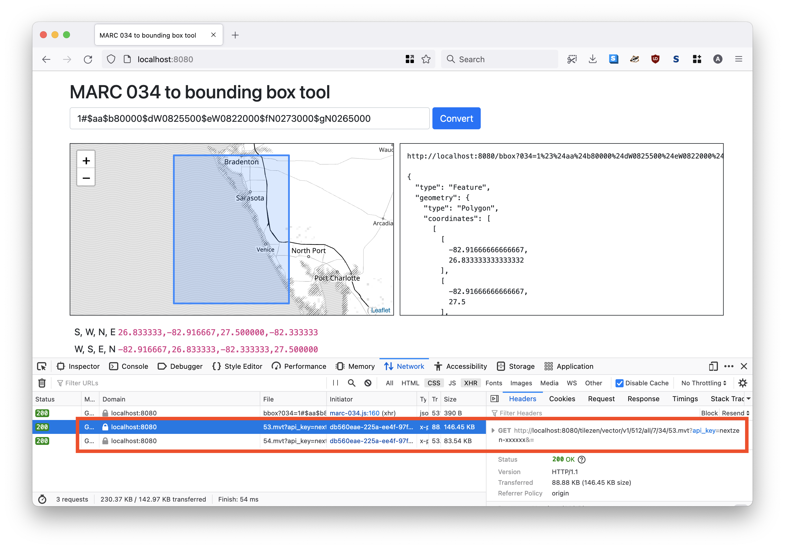

# go-marc

Go package for working with MARC records.

## Important

Not all of MARC. Probably not ever. Just the `034` field so far. If you are looking for a general-purpose library for working with MARC records I'd recommend looking at [miku/marc21](https://github.com/miku/marc21).

## Documentation

[](https://pkg.go.dev/github.com/aaronland/go-marc)

## Tools

```
$> make cli
go build -mod vendor -o bin/marc-034 cmd/marc-034/main.go
go build -mod vendor -o bin/marc-034d cmd/marc-034d/main.go
go build -mod vendor -o bin/marc-034-convert cmd/marc-034-convert/main.go
```

### marc-034

Parse one or more MARC 034 strings and emit a (S, W, N, E) bounding box for each.

```
$> ./bin/marc-034 -h
Parse one or more MARC 034 strings and emit a (S, W, N, E) bounding box for each.
Usage:
	 ./bin/marc-034 MARC034(N) MARC034(N)
```

Currently this only supports `hdddmmss (hemisphere-degrees-minutes-seconds)` and `dddmmss (degrees-minutes-seconds)` notation. For example:

```
$> ./bin/marc-034 '1#$aa$b22000000$dW1800000$eE1800000$fN0840000$gS0700000'
-70,-180,84,180
```

### marc-034-convert

Process one or more CSV files containing MARC 034 data and append bounding box information to a new CSV document.

```
$> ./bin/marc-034-convert -h
Process one or more CSV files containing MARC 034 data and append bounding box information to a new CSV document.
Usage:
	 ./bin/marc-034-convert csv-file(N) csv-file(N)
  -marc-034-column string
    	The name of the CSV column where MARC 034 data is stored. (default "marc_034")
  -max-x-column string
    	The name of the CSV column where the right-side coordinate (max x) of the bounding box should be stored. (default "max_x")
  -max-y-column string
    	The name of the CSV column where the top-side coordinate (max y) of the bounding box should be stored. (default "max_y")
  -min-x-column string
    	The name of the CSV column where the left-side coordinate (min x) of the bounding box should be stored. (default "min_x")
  -min-y-column string
    	The name of the CSV column where the bottom-side coordinate (min y) of the bounding box should be stored. (default "min_y")
  -to-file string
    	The path where your new CSV file should be created.
  -to-stdout
    	Output CSV data to STDOUT.
```

For example, given in an input CSV file that looks this:

```
$> cat test.csv
id,marc_034,name
123,1#$aa$b22000000$dW1800000$eE1800000$fN0840000$gS0700000,example
456,1#$aa$b80000$dW0825500$eW0822000$fN0273000$gN0265000,another example
```

Passing it to the `marc-034-convert` tool would yield:

```
$> ./bin/marc-034-convert -to-stdout ./test.csv
id,marc_034,max_x,max_y,min_x,min_y,name
123,1#$aa$b22000000$dW1800000$eE1800000$fN0840000$gS0700000,180,84,-180,-70,example
456,1#$aa$b80000$dW0825500$eW0822000$fN0273000$gN0265000,-82.33333333333333,27.5,-82.91666666666667,26.833333333333332,another example
```

### marc-034d

A web application for converting MARC 034 strings in to bounding boxes (formatted as GeoJSON)

```
$> ./bin/marc-034d -h
marc-034d is a web application for converting MARC 034 strings in to bounding boxes (formatted as GeoJSON).
Usage:
	 ./bin/marc-034d [options]
  -nextzen-api-key string
    	A valid Nextzen API key (default "xxxxxx")
  -nextzen-style-url string
    	A valid Nextzen style URL (default "/tangram/refill-style.zip")
  -nextzen-tilepack-database string
    	The path to a valid MBTiles database (tilepack) containing Nextzen MVT tiles.
  -nextzen-tilepack-uri string
    	The relative URI to serve Nextzen MVT tiles from a MBTiles database (tilepack). (default "/tilezen/vector/v1/512/all/{z}/{x}/{y}.mvt")
  -server-uri string
    	A valid aaronland/go-http-server URI (default "http://localhost:8080")
```

For example:

```
$> ./bin/marc-034d -nextzen-api-key {APIKEY}

2018/01/12 09:12:44 listening on localhost:8080
```

The `marc-034d` server exposes the following endpoints:

#### / (or "root")

The `/` (or default) endpoint will display a handy web interface for converting MARC 034 records in to bounding boxes. For example, here's what it looks like querying for `1#$aa$b80000$dW0825500$eW0822000$fN0273000$gN0265000`:


#### /bbox

The `/bbox` endpoint will return a bounding box for a MARC 034 field as GeoJSON.

```
$> curl -s 'http://localhost:8080/bbox?034=1%23%24aa$b22000000%24dW1800000%24eE1800000%24fN0840000%24gS0700000' | python -mjson.tool

{
    "bbox": [
        -180,
        -70,
        180,
        84
    ],
    "geometry": {
        "coordinates": [
            [
                [
                    -180,
                    -70
                ],
                [
                    -180,
                    84
                ],
                [
                    180,
                    84
                ],
                [
                    180,
                    -70
                ],
                [
                    -180,
                    -70
                ]
            ]
        ],
        "type": "Polygon"
    },
    "properties": {
        "marc:034": "1#$aa$b22000000$dW1800000$eE1800000$fN0840000$gS0700000"
    },
    "type": "Feature"
}
```

_Note the way the `034` parameter is URL-encoded._

### Nextzen, Nextzen API keys and Nextzen "tilepacks"

The default behaviour for the `marc-034d` application is to use the [TangramJS](https://github.com/tangrams/tangram) rendering engine in combination with the freely available [Nextzen vector tiles](https://nextzen.org/). Use of the Nextzen vector tiles requires a valid API key which can be created at:

* [https://developers.nextzen.org/](https://developers.nextzen.org/).

It is also possible to configure the `marc-034d` application to use Nextzen vector tile "tilepacks" to serve tile data locally. The tilepacks are just [MBTiles](https://github.com/mapbox/mbtiles-spec) databases containing vector tile data compiled using the [tilezen/go-tilepacks](https://github.com/tilezen/go-tilepacks#build) package.

To use a local tilepack with the `marc-034d` application pass the path to your database to the `-nextzen-tilepack-database` flag. For example:

```
$> ./bin/marc-034d -nextzen-tilepack-database tiles/nextzen-world-2019-1-10.db 
2021/10/23 14:27:33 listening on http://localhost:8080
```

The application won't perform any differently but if you look "under the hood" you'll see that the vector tile data is being served from the `marc-034d` application itself.



#### Notes

It is currently only possible to serve tiles from a single "tilepack" database.

It is not possible to dynamically limit the map to the zoom range and tile extent of a given "tilepack" database. Yet. I'm working on it.

There are precompiled databases with global tile coverage for zoom levels 1-10, 11 and 12 available on the Internet Archive:

* [Global tiles, zoom levels 1 through 10](https://archive.org/details/nextzen-world-2019-1-10) (1.8GB)
* [Global tiles, zoom level 11](https://archive.org/details/nextzen-world-2019-1-10) (3.5GB)
* [Global tiles, zoom level 12](https://archive.org/details/nextzen-world-2019-1-10) (7.9GB)

### Command-line flags and environment variables

Command line flags can be set also be set from environment variables. Environment variables for any given command line flag should be formatted as follows:

* Replace all `-` characters with `_`
* Upper case the flag name
* Prepend the string with `MARC_`

For example the equivalent environment variable for the `nextzen-api-key` flag would be `MARC_NEXTZEN_API_KEY`.

## Docker

[Yes](Docker), for `marc-034d` at least.

```
$> docker build -t marc-034d .

$> docker run -it -p 8080:8080 marc-034d \
	/usr/local/bin/marc-034d \
	-server-uri http://0.0.0.0:8080 \
	-nextzen-api-key {APIKEY} 
```

The Dockerfile will copy any "tilepacks" (ending in `.db`) in this package's `tiles` folder in to the container's `/usr/local/data/tiles` folder. This allows you to bundle and load local vector tile data with your container application. For example:

```
$> docker run -it -p 8080:8080 marc-034d \
	/usr/local/bin/marc-034d \
	-server-uri http://0.0.0.0:8080 \
	-nextzen-tilepack-database /usr/local/data/tiles/nextzen-world-2019-1-10.db 
```

_Note that any files ending in `.db` in the `tiles` folder are explicitly excluded from any Git commits._

## See also

* https://www.loc.gov/marc/bibliographic/bd034.html
* https://github.com/aaronland/go-http-tangramjs
* https://github.com/aaronland/go-http-bootstrap
* https://github.com/aaronland/go-http-server
* https://developers.nextzen.org/
