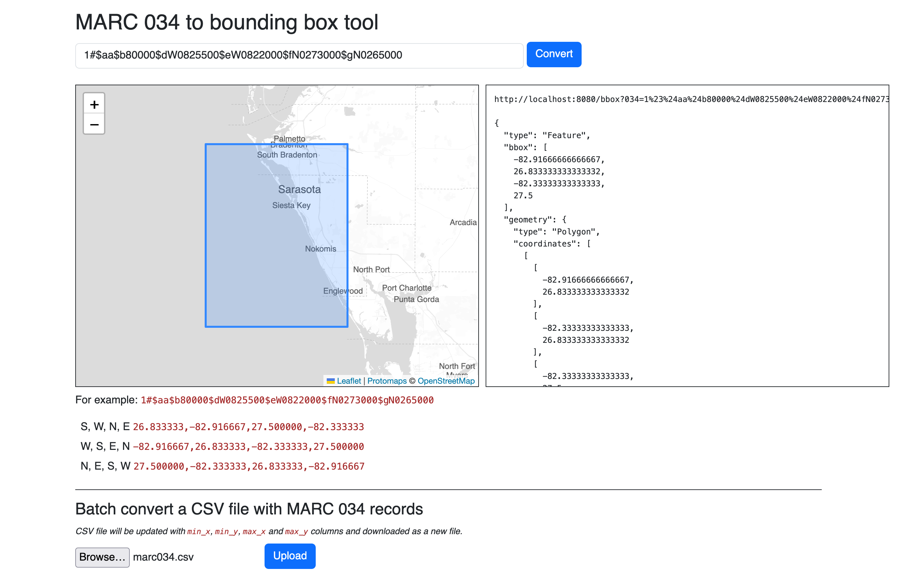
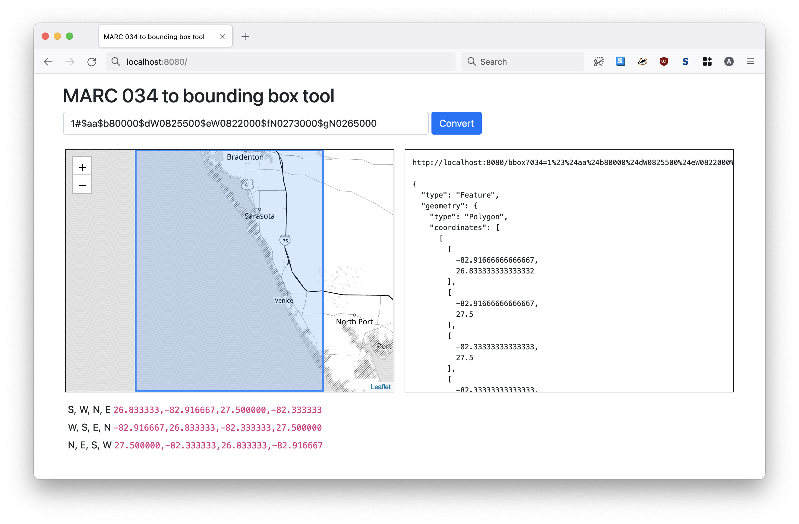

# go-marc

Go package for working with MARC records.

## Important

Not all of MARC. Probably not ever. Just the `034` field so far. If you are looking for a general-purpose library for working with MARC records I'd recommend looking at [miku/marc21](https://github.com/miku/marc21).

## Documentation

[](https://pkg.go.dev/github.com/aaronland/go-marc)

## Tools

```
$> make cli
go build -mod vendor -o bin/marc-034 cmd/marc-034/main.go
go build -mod vendor -o bin/marc-034d cmd/marc-034d/main.go
go build -mod vendor -o bin/marc-034-convert cmd/marc-034-convert/main.go
```

### marc-034

Parse one or more MARC 034 strings and emit a (S, W, N, E) bounding box for each.

```
$> ./bin/marc-034 -h
Parse one or more MARC 034 strings and emit a (S, W, N, E) bounding box for each.
Usage:
	 ./bin/marc-034 MARC034(N) MARC034(N)
```

Currently this only supports `hdddmmss (hemisphere-degrees-minutes-seconds)` and `dddmmss (degrees-minutes-seconds)` notation. For example:

```
$> ./bin/marc-034 '1#$aa$b22000000$dW1800000$eE1800000$fN0840000$gS0700000'
-70,-180,84,180
```

### marc-034-convert

Process one or more CSV files containing MARC 034 data and append bounding box information to a new CSV document.

```
$> ./bin/marc-034-convert -h
Process one or more CSV files containing MARC 034 data and append bounding box information to a new CSV document.
Usage:
	 ./bin/marc-034-convert csv-file(N) csv-file(N)
  -marc-034-column string
    	The name of the CSV column where MARC 034 data is stored. (default "marc_034")
  -max-x-column string
    	The name of the CSV column where the right-side coordinate (max x) of the bounding box should be stored. (default "max_x")
  -max-y-column string
    	The name of the CSV column where the top-side coordinate (max y) of the bounding box should be stored. (default "max_y")
  -min-x-column string
    	The name of the CSV column where the left-side coordinate (min x) of the bounding box should be stored. (default "min_x")
  -min-y-column string
    	The name of the CSV column where the bottom-side coordinate (min y) of the bounding box should be stored. (default "min_y")
  -to-file string
    	The path where your new CSV file should be created.
  -to-stdout
    	Output CSV data to STDOUT.
```

For example, given in an input CSV file that looks this:

```
$> cat test.csv
id,marc_034,name
123,1#$aa$b22000000$dW1800000$eE1800000$fN0840000$gS0700000,example
456,1#$aa$b80000$dW0825500$eW0822000$fN0273000$gN0265000,another example
```

Passing it to the `marc-034-convert` tool would yield:

```
$> ./bin/marc-034-convert -to-stdout ./test.csv
id,marc_034,max_x,max_y,min_x,min_y,name
123,1#$aa$b22000000$dW1800000$eE1800000$fN0840000$gS0700000,180,84,-180,-70,example
456,1#$aa$b80000$dW0825500$eW0822000$fN0273000$gN0265000,-82.33333333333333,27.5,-82.91666666666667,26.833333333333332,another example
```

### marc-034d

A web application for converting MARC 034 strings in to bounding boxes (formatted as GeoJSON)

```
$> ./bin/marc-034d -h
marc-034d is a web application for converting MARC 034 strings in to bounding boxes (formatted as GeoJSON).
Usage:
	 ./bin/marc-034d [options]
  -allow-uploads
    	Allow uploading and converting of CSV encoded MARC 034 reocrds. (default true)
  -map-provider string
    	Valid options are: leaflet, protomaps (default "leaflet")
  -map-tile-uri string
    	A valid Leaflet tile layer URI. See documentation for special-case (interpolated tile) URIs. (default "https://tile.openstreetmap.org/{z}/{x}/{y}.png")
  -marc034-column string
    	The name of the CSV column where MARC 034 data is stored. (default "marc_034")
  -maxx-column string
    	The name of the CSV column where the right-side coordinate (max x) of the bounding box should be stored. (default "max_x")
  -maxy-column string
    	The name of the CSV column where the top-side coordinate (max y) of the bounding box should be stored. (default "max_y")
  -minx-column string
    	The name of the CSV column where the left-side coordinate (min x) of the bounding box should be stored. (default "min_x")
  -miny-column string
    	The name of the CSV column where the bottom-side coordinate (min y) of the bounding box should be stored. (default "min_y")
  -protomaps-theme string
    	A valid Protomaps theme label. (default "white")
  -server-uri string
    	A valid aaronland/go-http-server URI. (default "http://localhost:8080")
  -style string
    	A custom Leaflet style definition for geometries. This may either be a JSON-encoded string or a path on disk.
```

For example:

```
$> bin/marc-034d \
	-map-provider protomaps \
	-map-tile-uri file:///usr/local/data/pmtiles/20240415.pmtiles

2025/02/27 09:43:38 listening on http://localhost:8080
```

This will start the `marc-034d` server available for viewing at `http://localhost:8080` using [Protomaps](https://protomaps.com) as the map tile provider reading a local PMFiles database. For example:



The `marc-034d` server has NO ACCCESS CONTROLS. There is no default mechanism for limiting access but, really, it's kind of assumed that you're running this on your desktop and not the public internet. If there is a need to do the latter there are ways to add that later on.

The `marc-034d` server exposes the following endpoints:

#### / (or "root")

The `/` (or default) endpoint will display a handy web interface for converting MARC 034 records in to bounding boxes. For example, here's what it looks like querying for `1#$aa$b80000$dW0825500$eW0822000$fN0273000$gN0265000`:



#### /bbox

The `/bbox` endpoint will return a bounding box for a MARC 034 field as GeoJSON.

```
$> curl -s 'http://localhost:8080/bbox?034=1%23%24aa$b22000000%24dW1800000%24eE1800000%24fN0840000%24gS0700000' | python -mjson.tool

{
    "bbox": [
        -180,
        -70,
        180,
        84
    ],
    "geometry": {
        "coordinates": [
            [
                [
                    -180,
                    -70
                ],
                [
                    -180,
                    84
                ],
                [
                    180,
                    84
                ],
                [
                    180,
                    -70
                ],
                [
                    -180,
                    -70
                ]
            ]
        ],
        "type": "Polygon"
    },
    "properties": {
        "marc:034": "1#$aa$b22000000$dW1800000$eE1800000$fN0840000$gS0700000"
    },
    "type": "Feature"
}
```

_Note the way the `034` parameter is URL-encoded._

#### /convert

The `/convert` endpoint accepts a CSV file "POST"-ed to the server as binary data and then returns a new CSV file with `min_x`, `min_y`, `max_x` and `max_y` properties.

```
$> bin/marc-034d \
	-map-provider protomaps \
	-map-tile-uri file:///usr/local/data/pmtiles/20240415.pmtiles \
	-allow-uploads
```		

```
$> curl -X POST http://localhost:8080/convert --data-binary @fixtures/marc034.csv
id,marc_034,max_x,max_y,min_x,min_y,name
123,1#$aa$b22000000$dW1800000$eE1800000$fN0840000$gS0700000,180,84,-180,-70,example
456,1#$aa$b80000$dW0825500$eW0822000$fN0273000$gN0265000,-82.33333333333333,27.5,-82.91666666666667,26.833333333333332,another example
```

Note that you can also just use the upload form in the web interface to do the same thing.

### Command-line flags and environment variables

Command line flags can be set also be set from environment variables. Environment variables for any given command line flag should be formatted as follows:

* Replace all `-` characters with `_`
* Upper case the flag name
* Prepend the string with `MARC_`

For example the equivalent environment variable for the `nextzen-api-key` flag would be `MARC_NEXTZEN_API_KEY`.

## See also

* https://www.loc.gov/marc/bibliographic/bd034.html
* https://github.com/aaronland/go-http-server