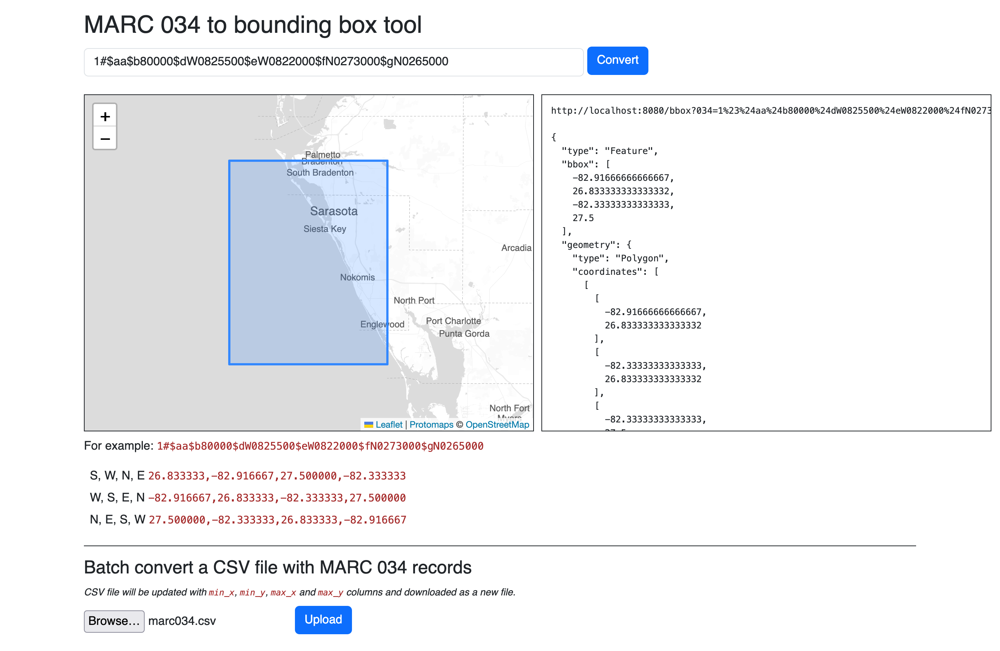

# server

A web application for converting MARC 034 strings in to bounding boxes (formatted as GeoJSON)

```
$> ./bin/server -h
marc-034d is a web application for converting MARC 034 strings in to bounding boxes (formatted as GeoJSON).
Usage:
	 ./bin/server [options]
  -enable-intersects
    	Enable intersecting geometry lookups for MARC034-derived bounding boxes.
  -initial-view string
    	A comma-separated string indicating the map's initial view. Valid options are: 'LON,LAT', 'LON,LAT,ZOOM' or 'MINX,MINY,MAXX,MAXY'.
  -leaflet-point-style string
    	A custom Leaflet style definition for point geometries. This may either be a JSON-encoded string or a path on disk.
  -leaflet-style string
    	A custom Leaflet style definition for geometries. This may either be a JSON-encoded string or a path on disk.
  -map-provider string
    	Valid options are: leaflet, protomaps (default "leaflet")
  -map-tile-uri string
    	A valid Leaflet tile layer URI. See documentation for special-case (interpolated tile) URIs. (default "https://tile.openstreetmap.org/{z}/{x}/{y}.png")
  -marc034-column string
    	The name of the CSV column where MARC 034 data is stored. (default "marc_034")
  -protomaps-theme string
    	A valid Protomaps theme label. (default "white")
  -server-uri string
    	A valid aaronland/go-http-server URI. (default "http://localhost:8080")
  -spatial-database-source value
    	Zero or more '{ITERATOR_URI}#{ITERATOR_SOURCE}' strings following the whosonfirst/go-whosonfirst-iterate/v2 URI syntax.
  -spatial-database-uri string
    	A registered whosonfirst/go-whosonfirst-spatial/database.SpatialDatabase URI.
  -verbose
    	Enable verbose (debug) logging.
```

## Example

For example:

```
$> bin/server \
	-map-provider protomaps \
	-map-tile-uri file:///usr/local/data/pmtiles/20240415.pmtiles

2025/02/27 09:43:38 listening on http://localhost:8080
```

This will start the `server` tool, which can then be viewed at `http://localhost:8080`, using [Protomaps](https://protomaps.com) as the map tile provider reading a local PMFiles database. For example:



The `server` tool has NO ACCCESS CONTROLS. There is no default mechanism for limiting access but, really, it's kind of assumed that you're running this on your desktop and not the public internet. If there is a need to do the latter there are ways to add that later on.

## Endpoints

The `server` exposes the following endpoints:

### / (or "root")

The `/` (or default) endpoint will display a handy web interface for converting MARC 034 records in to bounding boxes. For example, here's what it looks like querying for `1#$aa$b80000$dW0825500$eW0822000$fN0273000$gN0265000`:


### /bbox

The `/bbox` endpoint will return a bounding box for a MARC 034 field as GeoJSON.

```
$> curl -s 'http://localhost:8080/bbox?034=1%23%24aa$b22000000%24dW1800000%24eE1800000%24fN0840000%24gS0700000' | python -mjson.tool

{
    "bbox": [
        -180,
        -70,
        180,
        84
    ],
    "geometry": {
        "coordinates": [
            [
                [
                    -180,
                    -70
                ],
                [
                    -180,
                    84
                ],
                [
                    180,
                    84
                ],
                [
                    180,
                    -70
                ],
                [
                    -180,
                    -70
                ]
            ]
        ],
        "type": "Polygon"
    },
    "properties": {
        "marc:034": "1#$aa$b22000000$dW1800000$eE1800000$fN0840000$gS0700000"
    },
    "type": "Feature"
}
```

_Note the way the `034` parameter is URL-encoded._

### /convert

The `/convert` endpoint accepts a CSV file "POST"-ed to the server as binary data and then returns a new CSV file with `min_x`, `min_y`, `max_x` and `max_y` properties.

```
$> bin/marc-034d \
	-map-provider protomaps \
	-map-tile-uri file:///usr/local/data/pmtiles/20240415.pmtiles \
	-allow-uploads
```		

For example:

```
$> curl -X POST http://localhost:8080/convert --data-binary @fixtures/marc034.csv
error,id,marc_034,max_x,max_y,min_x,min_y,name,valid,intersects
,123,1#$aa$b22000000$dW1800000$eE1800000$fN0840000$gS0700000,180,84,-180,-70,example,1,
,456,1#$aa$b80000$dW0825500$eW0822000$fN0273000$gN0265000,-82.33333333333333,27.5,-82.91666666666667,26.833333333333332,another example,1,
```

_Note that you can also just use the upload form in the web interface to do the same thing if you don't want to use the command line._

## Intersecting (Who's On First) geometries

There is optional support for retrieving [Who's On First](https://whosonfirst.org) records whose geometries intersect a bounding box derived from a MARC 034 record. For example:

```
$> bin/server \
	-map-provider protomaps \
	-map-tile-uri file:///usr/local/data/pmtiles/20240415.pmtiles \
	-enable-intersects \
	-spatial-database-uri 'rtree:///?strict=false&index_alt_files=0' \
	-spatial-database-source 'repo://#/usr/local/data/sfomuseum-data-whosonfirst'
	
2025/03/07 17:02:44 INFO Indexing spatial database.
2025/03/07 17:03:11 INFO time to index paths (1) 27.344129833s
2025/03/07 17:03:11 INFO Listening for requests address=http://localhost:8080
```

Which will produce results like this:


If intersecting geometries are enabled they will also be applied to the "batch" convert endpoint. Intersecting WOF records are recorded in the `intersects` column as a (comma-separated) list of [machine tags](https://web.archive.org/web/20160420154054/https://www.flickr.com/groups/api/discuss/72157594497877875/) in the form of:

"wof:" + `{WHOSONFIRST_PLACETYPE}` + "=" + `{WHOSONFIRST_ID}`

Under the hood this is using the [whosonfirst/go-whosonfirst-spatial](https://github.com/whosonfirst/go-whosonfirst-spatial) package. That package is written in such a way as to be database-agnostic. It provides a default in-memory RTree-based spatial index but other (more performant) database implementations are defined in other packages.

That's the `-spatial-database-uri 'rtree:///?strict=false&index_alt_files=0'` part in the command above. That's also why it takes 27 seconds to index the [sfomuseum-data/sfomuseum-data-whosonfirst](https://github.com/sfomuseum-data/sfomuseum-data-whosonfirst) repository. There are package implementing the `go-whosonfirst-spatial` interfaces for the following databases:

* [whosonfirst/go-whosonfirst-spatial-sqlite](https://github.com/whosonfirst/go-whosonfirst-spatial-sqlite)
* [whosonfirst/go-whosonfirst-spatial-pmtiles](https://github.com/whosonfirst/go-whosonfirst-spatial-pmtiles)
* [whosonfirst/go-whosonfirst-spatial-duckdb](https://github.com/whosonfirst/go-whosonfirst-spatial-duckdb)

Support for these databases is _not_ bundled with this package. In order to use them you will need to clone the `cmd/marc-034d` tool and add the relevant. To that end the "guts" of that application have been moved in to an easy-to-use package (`app/server`) to save time-and-typing. For example here is how you would write a custom `marc-034d` tool to use a SQLite database (using the `go-whosonfirst-spatial-sqlite` package):

```
package main

import (
	"context"
	"log"

	_ "github.com/whosonfirst/go-whosonfirst-spatial-sqlite"
	"github.com/aaronland/go-marc/v3/app/server"
)

func main() {

	ctx := context.Background()
	err := server.Run(ctx)

	if err != nil {
		log.Fatalf("Failed to run server, %v", err)
	}
}

```

Which would then be started like this:

```
$> bin/server \
	-map-provider protomaps \
	-map-tile-uri file:///usr/local/data/pmtiles/20240415.pmtiles \
	-enable-intersects \
	-spatial-database-uri 'sqlite://mattn?dsn=/path/to/sqlite.db' \
```

_Note the absense of the `-spatial-database-source` flag because it is assumed the SQLite database has already been indexed (using the [whosonfirst/go-whosonfirst-database-sqlite](https://github.com/whosonfirst/go-whosonfirst-database-sqlite) package)._

## Command-line flags and environment variables

Command line flags can be set also be set from environment variables. Environment variables for any given command line flag should be formatted as follows:

* Replace all `-` characters with `_`
* Upper case the flag name
* Prepend the string with `MARC_`

For example the equivalent environment variable for the `server-uri` flag would be `MARC_SERVER_URI`.

## See also

* https://github.com/aaronland/go-http-server
* https://github.com/whosonfirst/go-whosonfirst-spatial